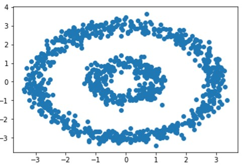
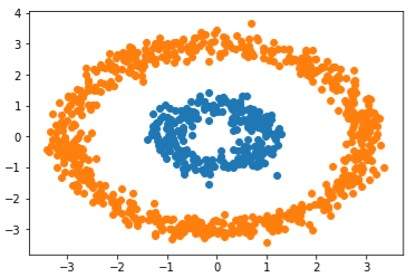

# Bi-Partitioning (2-way Spectral Clustering)

We are given 1000 two-dimensional data points which need to be clustered into 2 components. The data can be visualized as follows:

## Results

By varying the value of sigma in the algorithm, we can achieve an optimized clustering using sigma = 0.4 as follows: 

## License

[MIT](https://choosealicense.com/licenses/mit/)